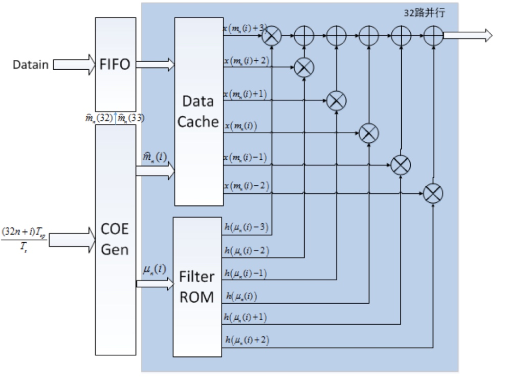

> 以毕业论文《柔性速率可变的宽带16QAM16APSK调制解调器的设计与实现》为学习材料

## 变速率成型滤波的实现

### 成型滤波的表达式

当基带系统的总特性等效为理想低通滤波器时，可实现无码间串扰，但理想的低通滤波器在实际中无法实现，因此在发射端利用根升余弦滤波器对发送信号进行成型滤波，在接收端也用根升余弦滤波器对接收信号进行匹配滤波，这样能使整个信道等效与与低通特性相近的滤波器，可以让系统在本码元的抽样时刻($t=0$)时的值最大，在其他码元抽样时刻($t=\pm k T_{s}$)为0。

根升余弦滤波器的时域响应为
$$
h_{T}(t)=h_{R}(t)=4 \alpha \frac{\cos \left((1+\alpha) \pi t / T_{s}\right)+\frac{\sin \left((1-\alpha) \pi t / T_{s}\right)}{\left(4 \alpha t / T_{s}\right)}}{\pi \sqrt{T_{s}}\left(1-\left(4 \alpha t / T_{s}\right)^{2}\right)}
$$

### 基于数字重采样技术的速率转换方法的公式推导

> 什么是变速率，为什么要进行速率变换？为什么要进行高速并行可变符号速率调制？
1. 一般发射端DA或者接收端AD的采样率会在设计之初便定下来，以保证程序的正常运行，但是，符号速率有可能会根据实际情况进行调整，这样在相同的采样率下，符号的过采样倍数就会不同，而且有时过采样的倍数可能为小数，这样成型滤波器就需要专门设计，并且保证速率可变，以适应不同速率的输入信号。
2. 由于FPGA内部处理时钟一般不超过200MHz，要实现高速信号Gbps调制，必须使用全并行架构，这时候调制就需要并行架构了。

---

根据奈奎斯特采样定理，只要采样频率大于信号带宽的两倍，就可以从采样值$x(nT_s)$中恢复出原始信号$y(t)$
$$
y(t)=\sum_{n=-\infty}^{+\infty} x\left(n T_{s}\right) h\left(t-n T_{s}\right)
$$
这里$x(t)$为输入信号，$h(t)$为滤波器时域响应，$T_s$为符号周期。

> 该公式的物理意义是：如果我当前要得到输出信号$y(t)$，那么我要对输入信号与滤波器进行卷积。而你会发现输入信号是离散的，其采样时刻为$nT_s$，而滤波器的时域响应是以$t$为原点的。这个公式非常的普通，但是必须要深入理解该公式才能理解后面的推导。

如果对上面这个恢复的信号进行重采样，即我想获得某个我想要的点的信号，我会首先想到将上面公式中的$t$替换成我想要的点的时刻，比如$kT_{sp}$，有如下公式：
$$
y\left(k T_{sp}\right)=\sum_{n=-\infty}^{+\infty} x\left(n T_{s}\right) h\left(k T_{sp}-n T_{s}\right)=\sum_{n=-\infty}^{+\infty} x\left(n T_{s}\right) h\left(T_{s}\left(\frac{k T_{sp}}{T_{s}}-n\right)\right)
$$

> 这里的$T_{sp}$可以理解成DA的采样周期，其物理含义是我当前要对符号进行调制，给定了采样周期为$T_{sp}$，那么其通过上述公式可以求出其$y(kT_{sp})$，因为我当前的信息符号周期是$T_s$（偏慢），但是我DA采样的时候其采样周期为$kT_{sp}$（偏快），所以我需要利用上述公式对速率偏慢的信息符号通过成型滤波生成速率较高的信号，然后给到DA进行输出。
>
> 可以看出，$x(nT_s)$是与$x(T_{sp})$无关的，只与$h(t)$有关。

对上述公式进行化简，令$m_{k}=\left\lfloor\frac{k T_{sp}}{T_{s}}\right\rfloor$，$\mu_{k}=\frac{k T_{sp}}{T_{s}}-m_{k}$，代入上式可得：
$$
y\left(k T_{sp}\right)=\sum_{n=-\infty}^{+\infty} x\left(n T_{s}\right) h\left(\left(m_{k}+\mu_{k}-n\right) T_{s}\right)
$$
再令$m=m_{k}-n$，可得：
$$
y\left(k T_{sp}\right)=\sum_{m=-\infty}^{+\infty} x\left(\left(m_{k}-m\right) T_{s}\right) h\left(\left(\mu_{k}+m\right) T_{s}\right)
$$

> 这里通过化简，$y(kT_{sp})$只与$x\left(\left(m_{k}-m\right) T_{s}\right)$以及$h\left(\left(\mu_{k}+m\right) T_{s}\right)$有关，这里面涉及到的整数参数有$m_k, m$以及小数参数有$\mu_k$，对于$x(t)$，由于里面的索引要求是整数的，所以$m_k-m$符合要求，此时抽取的是正常的$x$序列，而对于$h$，由于其涉及到小数，所以我们会先对$h$进行过采样，然后再正常抽取，但是这个$m$所对应的是原本没有偏移的正确采样点的位置，加上$\mu_k$是偏移。
>
> **疑问**
>
> 我个人觉得上面两条公式看上去是等价的，但是一旦把取值范围确定后，两条公式不是等价的吧？

由于无法做到无穷项求和，所以可以将滤波器截短。
$$
\begin{aligned}
y\left(k T_{sp}\right) &=\sum_{m=-I_{1}}^{I_{2}} x\left(\left(m_{k}-m\right) T_{s}\right) h\left(\left(\mu_{k}+m\right) T_{s}\right) \\\\
&=\sum_{m=-I_{1}}^{I_{2}} h_{T}\left(\mu_{k}+m\right) x\left(m_{k}-m\right)
\end{aligned}
$$
由于$T_s$对于$x$和$h$来说都表示当前索引是在序列内抽取的，是一个倍数关系，所以这个倍数关系可以忽略掉，我们只要做好由$x((m_k-m)-T_s)$到$x(m_k-m)$的映射就可以了。

### 可变速率成型滤波器设计

在FPGA中，由于无法实时计算$h_{T}\left(\mu_{k}+m\right)$，因此采用查找表的形式来实现。过采样倍数决定了这里的$\mu_k$的精度，如果设定$\mu_k$的精度为$\frac{1}{2^{-12}}$，那么对于5Gsps采样率来说，变速率的步进即为$1.22Msps$。

按照上一节的说法，假设当前符号前后间隔超过3个符号的影响可忽略不计，把滤波器截短可以得到：
$$
y(kT_{sp})=\sum_{m=-3}^{+2} h_{T}\left(\mu_{k}+m\right) x\left(m_{k}-m\right)
$$

> 具体做法：
>
> 用Matlab 的 rcosdesign 函数生成一组 α=0.35,过采样倍数为 4096,双边 6 个符号的系数,将其量化为 12bit,然后按符号分为 6 组,每组 4096 个系数,分别存入6 个 ROM 核中,ROM 核宽度为 12,深度为 4096。这样，我们将$\mu_k$和$m$均扩大$2^{12}$倍作为索引地址，分别把运算所需的6个系数都求出来。

假设当前采样率为5Gsps，在200MHz及以下时钟频率下，要32路并行运算，可以将公式修改为
$$
y(32n+i) = \sum_{m=-3}^{+2}h_T(\mu_n(i)+m)x(m_n(i)-m)
$$
式中$n$为时刻值，$i$为并行的路数的序数。$m_{n}(i)=\left\lfloor\frac{(32 n+i) T_{s p}}{T_{s}}\right\rfloor$，$\mu_{n}(i)=\frac{(32 n+i) T_{s p}}{T_{s}}-m_{n}(i)$。

整个模块的实现框图如下所示：输入的符号数据先通过FIFO缓存，再输出给DataCache，由COEGen算出$m_n(i)$和$\mu_n(i)$，分别从DataCache和FilterRom中取出6对待内插成型的符号和滤波器系数，相乘求和即得到一路成型输出。

### 可变速率成型滤波模块的一些参数讨论

本项目用到的最高采样率为$5Gsps$，最高符号速率为$1200Msps$，在这个条件下，有$\frac{32T_{sp}}{T_s}=7.68$，即在32路并行时，$m_n(1)$和$m_n(32)$最多相差8，因此，$m_n(i)$的取值区间为$[0, 7]$，再考虑上$m_{n}(1)-2$和$m_{n}(32)+3$，在32路并行成型滤波时，共需要13个符号参与运算。所以DataCache需要对从FIFO输入的8路并行符号数据缓存一拍，接到下一个时刻的数据之前，变成16路并行的数据，以满足滤波的速率要求。

寄存器寻址方案，为了使精度能够满足设计的需要，我们用53位表示$\frac{(32 n+i) T_{s p}}{T_{s}}$，其中3位整数位，50位小数位，即$m_n(i)$取整数位3位，$\mu_n(i)$取高12小数位。

还有FIFO取数的策略，这个直接参考文献即可。

---

## 高速并行匹配滤波器的实现

### $Z$变换

> 向系统输入$\delta(n)$得到脉冲响应$h(n)$，例如$h(n)=\left[\begin{array}{lll}1 & 2 & 1\end{array}\right]$
>
> 这时候我们再向系统输入另外一个信号，例如：$x(n)=[1\quad 2\quad 1]=\delta(n)+2 \delta(n-1)+\delta(n-2)$
>
> 那么输出信号就应该是$y(n)=[1\quad 4\quad 6\quad 4\quad 1]=h(n)+2 h(n-1)+h(n-2)=x(n)* h(n)$（卷积运算）
>
> 经过观察可以发现，这其实就是$[1\quad 2\quad 1]$和$[1\quad 2\quad 1]$的多项式相乘！！！
>
> 因此我们将信号$x(n)$改写成$X(Z)=1+2 Z^{-1}+Z^{-2}$，同理，脉冲响应也写成$H(Z)=1+2 Z^{-1}+Z^{-2}$，则有$Y(Z) = 1+4 Z^{-1}+6 Z^{-2}+4 Z^{-3}+Z^{-4} = X(Z)H(Z)$，这种变换就称为$Z$变换。
>
> ⭐️ **$Z^{-1}$对应的是下一个时钟周期（未来）的数据**

### 公式推导

一个N阶的 FIR 滤波器在时域上可表示为：
$$
y(n)=h(n) * x(n)=\sum_{i=0}^{N-1} h(i) x(n-i), \quad n=0,1,2, \ldots, \infty
$$
上式对应的Z变换可以表示为：
$$
Y(z)=H(z) \cdot X(z)=\left(\sum_{n=0}^{N-1} h(n) z^{-n}\right) \cdot\left(\sum_{n=0}^{\infty} x(n) z^{-n}\right)
$$
根据论文，可以将序列$x(n)$和$h(n)$的$z$变换拆分成偶数时间序列和奇数时间序列的$Z$变换：
$$
\begin{aligned}
X(z) &=x(0)+x(1) z^{-1}+x(2) z^{-2}+x(3) z^{-3}+\cdots+x(n) z^{-n} \\\\
&=\left[x(0)+x(2) z^{-2}+x(4) z^{-4}+x(6) z^{-6} \cdots\right] \\\\
&+z^{-1}\left[x(1)+x(3) z^{-2}+x(5) z^{-4}+x(7) z^{-6} \cdots\right] \\\\
&=X_{0}\left(z^{2}\right)+z^{-1} X_{1}\left(z^{2}\right)
\end{aligned}
$$
同理，有
$$
H(z)=H_{0}\left(z^{2}\right)+z^{-1} H_{1}\left(z^{2}\right)
$$

则对应的$y(n)$序列也可以表示为偶数时间序列和奇数时间序列的求和：
$$
Y(z)=Y_{0}\left(z^{2}\right)+z^{-1} Y_{1}\left(z^{2}\right)
$$

$$
\begin{array}{c}
Y_{0}\left(z^{2}\right)=X_{0}\left(z^{2}\right) H_{0}\left(z^{2}\right)+\mathrm{z}^{-2}\left(X_{1}\left(z^{2}\right) H_{1}\left(z^{2}\right)\right) \\\\
Y_{1}\left(z^{2}\right)=X_{0}\left(z^{2}\right) H_{1}\left(z^{2}\right)+X_{1}\left(z^{2}\right) H_{0}\left(z^{2}\right)
\end{array}
$$

写成矩阵形式可有：
$$
\left[\begin{array}{c}
Y_{0} \\\\
Y_{1}
\end{array}\right]=\left[\begin{array}{cc}
H_{0} & z^{-2} H_{1} \\\\
H_{1} & H_{0}
\end{array}\right] \cdot\left[\begin{array}{c}
X_{0} \\\\
X_{1}
\end{array}\right]
$$
假设L路并行，则可对其进行拓展：
$$
\left[\begin{array}{c}
Y_{0} \\\\
Y_{1} \\\\
\ldots \\\\
Y_{L-1}
\end{array}\right]=\left[\begin{array}{cccc}
H_{0} & z^{-L} H_{L-1} & \ldots & z^{-L} H_{1} \\\\
H_{1} & H_{0} & \ldots & z^{-L} H_{2} \\\\
\ldots & \ldots & \ldots & \ldots \\\\
H_{L-1} & H_{L-2} & \ldots & H_{0}
\end{array}\right] \cdot\left[\begin{array}{c}
X_{0} \\\\
X_{1} \\\\
\ldots \\\\
X_{L-1}
\end{array}\right]
$$

### 高速并行匹配滤波器的实现方法

此处采用32路并行，输入的IQ数据各只有16路，滤波器的系数长度为25，即`rcosdesign(0.35, 4, 6, 'sqrt')`。

为了简单，此处先假设滤波器系数长度为32，推导出其做法，再简化成滤波器系数长度为25的情况。对于I路来说，其输入$x(n)$只有偶数序列的形式，即只有$x(2k)$的情况下不为0，$x(2k+1)$的情况下恒等于0，但其依旧对应两组（每组长度16）的输出，分别为
$$
Y_{2 k}=\left\lbrace\begin{array}{cc}
\left(\sum_{i=0}^{k} H_{2 i} X_{2(k-i)}\right)+z^{-32}\left(\sum_{i=k+1}^{15} H_{2 i} X_{32+2(k-i)}\right), & 0 \leq k \leq 14 \\\\
\sum_{i=0}^{15} H_{2 i} X_{2(k-i)}, & k=15
\end{array}\right.
$$

$$
Y_{2 k+1}=\left\lbrace\begin{array}{cc}
\left(\sum_{i=0}^{k} H_{2 i+1} X_{2(k-i)}\right)+z^{-32}\left(\sum_{i=k+1}^{15} H_{2 i+1} X_{32+2(k-i)}\right), & 0 \leq k \leq 14 \\\\
\sum_{i=0}^{15} H_{2 i+1} X_{2(k-i)}, & k=15
\end{array}\right.
$$

其实也就是
$$
\left[\begin{array}{c}
Y_{0} \\\\
Y_{1} \\\\
\ldots \\\\
Y_{31}
\end{array}\right]=\left[\begin{array}{cccc}
H_{0} & z^{-32} H_{31} & \ldots & z^{-32} H_{1} \\\\
H_{1} & H_{0} & \ldots & z^{-32} H_{2} \\\\
\ldots & \ldots & \ldots & \ldots \\\\
H_{31} & H_{30} & \ldots & H_{0}
\end{array}\right] \cdot\left[\begin{array}{c}
X_{0} \\\\
0 \\\\
X_{2}\\\\
0\\\\
X_{3}\\\\
\ldots \\\\
X_{30}\\\\
0
\end{array}\right]
$$
同理，对于Q路也一样，为
$$
\left[\begin{array}{c}
Y_{0} \\\\
Y_{1} \\\\
\ldots \\\\
Y_{31}
\end{array}\right]=\left[\begin{array}{cccc}
H_{0} & z^{-32} H_{31} & \ldots & z^{-32} H_{1} \\\\
H_{1} & H_{0} & \ldots & z^{-32} H_{2} \\\\
\ldots & \ldots & \ldots & \ldots \\\\
H_{31} & H_{30} & \ldots & H_{0}
\end{array}\right] \cdot\left[\begin{array}{c}
0\\\\
X_{1} \\\\
0 \\\\
X_{3}\\\\
\ldots \\\\
0\\\\
X_{31}
\end{array}\right]
$$

$$
Y_{2 k}=\left\lbrace\begin{array}{cc}z^{-32}\left(\sum_{i=0}^{15} H_{2 i+1} X_{31+2(k-i)}\right), & k=0 \\\\ 
\left(\sum_{i=0}^{k-1} H_{2 i+1} X_{2(k-i)-1}\right)+z^{-32}\left(\sum_{i=k}^{15} H_{2 i+1} X_{31+2(k-i)}\right), & 1 \leq k \leq 15\end{array}\right.
$$

$$
Y_{2 k+1}=\left\lbrace\begin{array}{cc}
\left(\sum_{i=0}^{k} H_{2 i} X_{2(k-i)+1}\right)+z^{-32}\left(\sum_{i=k+1}^{15} H_{2 i} X_{33+2(k-i)}\right), & 0 \leq k \leq 14 \\\\
\sum_{i=0}^{15} H_{2 i} X_{2(k-i)+1}, & k=15
\end{array}\right.
$$

如果对里面的元素全部分别相乘，可以看出，对于$H$矩阵的第一列，会分别与$X_0$相乘，对于$H$矩阵的第三列，会分别与$X_2$相乘，对于$H$矩阵的第31列，会分别与$X_{30}$相乘，乘出来待用的参数分别如下：
$$
H_0X_0, \quad H_1X_0, \quad  H_2X_0, \quad  H_3X_0, \quad  \cdots, \quad  H_{31}X_0
$$

$$
z^{-32}H_{30}X_2, \quad  z^{-32}H_{31}X_2, \quad  H_{0}X_2, \quad  H_{1}X_2, \quad  \cdots, \quad  H_{29}X_2
$$

$$
\cdots
$$

$$
z^{-32}H_{1}X_{30}, \quad  z^{-32}H_{2}X_{30}, \quad  z^{-32}H_{3}X_{30}, \quad  z^{-32}H_{4}X_{30}, \quad  \cdots, \quad  H_{0}X_{30}
$$

由于滤波器参数是对称的，所以其实$H_0X_0$和$H_{31}X_0$是一样的，因此只需要一半的滤波器系数即可，而且由于矩阵中有一半的运算是通过延迟32个时钟（这里32路并行，相当于只需要延迟一个时钟周期即可）实现的，所以可以将结果分成两部分，一部分先延时，再输入流水相加模块，另一部分直接输入流水相加模块，进行流水线相加，实现整个低通滤波的过程，其具体实现框图如图所示：

**对于匹配滤波的实现**，由于其同样是32路并行输入并且其阶数只有25，即$H_{25}-H_{31}$均为0，其余系数$H_0-H_{24}$非0，所以可以列出其算法：
$$
\left[\begin{array}{c}
Y_{0} \\\\
Y_{1} \\\\
\ldots \\\\
Y_{31}
\end{array}\right]=\left[\begin{array}{ccccc}
H_{0} & 0 & 0 & \ldots & z^{-32} H_{1} \\\\
H_{1} & H_{0} & 0 & \ldots & z^{-32} H_{2} \\\\
\ldots & \ldots & \ldots  & \ldots & \ldots \\\\
0 & 0 & 0 & \ldots & H_{0}
\end{array}\right] \cdot\left[\begin{array}{c}
X_{0} \\\\
X_{1} \\\\
\ldots \\\\
X_{31}
\end{array}\right]
$$
其实现过程与低通滤波器的实现过程几乎一致，只不过有不少空白的系数可以省去运算步骤。

**为了Matlab实现时查找的方便，下面分别列出32路并行的I路和Q路对应的矩阵表达式以及求和公式：**
$$
Y_I= \left[\begin{array}{c}
Y_{0} \\\\
Y_{1} \\\\
\ldots \\\\
Y_{31}
\end{array}\right]=\left[\begin{array}{ccccc}
H_{0} & 0 & 0 & \ldots & z^{-32} H_{1} \\\\
H_{1} & H_{0} & 0 & \ldots & z^{-32} H_{2} \\\\
\ldots & \ldots & \ldots  & \ldots & \ldots \\\\
0 & 0 & 0 & \ldots & H_{0}
\end{array}\right] \cdot\left[\begin{array}{c}
X_{0} \\\\
0 \\\\
X_{2}\\\\
0\\\\
\ldots \\\\
X_{30}\\\\
0
\end{array}\right]
$$

$$
Y_{I(2 k)}=\left\lbrace\begin{array}{cc}
\left(\sum_{i=0}^{k} H_{2 i} X_{2(k-i)}\right)+z^{-32}\left(\sum_{i=k+1}^{12} H_{2 i} X_{32+2(k-i)}\right), & 0 \leq k <12 \\\\
\sum_{i=0}^{12} H_{2 i} X_{2(k-i)}, & 12 \leq k \leq 15
\end{array}\right.
$$

$$
Y_{I(2 k+1)}=\left\lbrace\begin{array}{cc}
\left(\sum_{i=0}^{k} H_{2 i+1} X_{2(k-i)}\right)+z^{-32}\left(\sum_{i=k+1}^{11} H_{2 i+1} X_{32+2(k-i)}\right), & 0 \leq k \leq 11 \\\\
\sum_{i=0}^{11} H_{2 i+1} X_{2(k-i)}, & 11 \leq k \leq 15
\end{array}\right.
$$

$$
Y_Q= \left[\begin{array}{c}
Y_{0} \\\\
Y_{1} \\\\
\ldots \\\\
Y_{31}
\end{array}\right]=\left[\begin{array}{ccccc}
H_{0} & 0 & 0 & \ldots & z^{-32} H_{1} \\\\
H_{1} & H_{0} & 0 & \ldots & z^{-32} H_{2} \\\\
\ldots & \ldots & \ldots  & \ldots & \ldots \\\\
0 & 0 & 0 & \ldots & H_{0}
\end{array}\right] \cdot\left[\begin{array}{c}
0 \\\\
X_{1} \\\\
0\\\\
X_{3}\\\\
\ldots \\\\
0\\\\
X_{31}
\end{array}\right]
$$

$$
Y_{Q(2 k)}=\left\lbrace\begin{array}{cc}
z^{-32}\left(\sum_{i=0}^{11} H_{2 i+1} X_{31+2(k-i)}\right), & k=0 \\\\ 
\left(\sum_{i=0}^{k-1} H_{2 i+1} X_{2(k-i)-1}\right)+z^{-32}\left(\sum_{i=k}^{11} H_{2 i+1} X_{31+2(k-i)}\right), & 0 < k \leq 12 \\\\
\left(\sum_{i=0}^{11} H_{2 i+1} X_{2(k-i)-1}\right), & 12 \leq k \leq 15
\end{array}\right.
$$

$$
Y_{Q(2 k+1)}=\left\lbrace\begin{array}{cc}
\left(\sum_{i=0}^{k} H_{2 i} X_{2(k-i)+1}\right)+z^{-32}\left(\sum_{i=k+1}^{12} H_{2 i} X_{33+2(k-i)}\right), & 0 \leq k < 13 \\\\
\sum_{i=0}^{12} H_{2 i} X_{2(k-i)+1}, & 13 \leq k \leq 15
\end{array}\right.
$$

---

**64路并行的也直接罗列于此：**
对于I路，有

$$
Y_{I(2 k)}=\left\lbrace\begin{array}{cl}
\left(\sum_{i=0}^{k} H_{2 i} X_{2(k-i)}\right)+z^{-64}\left(\sum_{i=k+1}^{31} H_{2 i} X_{64+2(k-i)}\right) & 0 \leq k \leq 30 \\\\
\sum_{i=0}^{31} H_{2 i} X_{2(k-i)} & , k=31
\end{array}\right.
$$
$$
Y_{I(2 k+1)}=\left\lbrace\begin{array}{cc}
\left(\sum_{i=0}^{k} H_{2 i+1} X_{2(k-i)}\right)+z^{-64}\left(\sum_{i=k+1}^{31} H_{2 i+1} X_{64+2(k-i)}\right) & , 0 \leq k \leq 30 \\\\
\sum_{i=0}^{31} H_{2 i+1} X_{2(k-i)} & , k=31
\end{array}\right.
$$

对应的矩阵表示为：

$$
\left[\begin{array}{c}
Y_{0} \\\\
Y_{1} \\\\
\cdots \\\\
Y_{63}
\end{array}\right]=\left[\begin{array}{cccc}
H_{0} & z^{-64} H_{63} & \cdots & z^{-64} H_{1} \\\\
H_{1} & H_{0} & \cdots & z^{-64} H_{2} \\\\
\cdots & \cdots & \cdots & \cdots \\\\
H_{63} & H_{62} & \cdots & H_{0}
\end{array}\right]\left[\begin{array}{c}
X_{0} \\\\
0 \\\\
X_{2} \\\\
0 \\\\
X_{4} \\\\
\cdots \\\\
X_{62} \\\\
0
\end{array}\right]
$$

同理，Q路为：

$$
\left[\begin{array}{c}
Y_{0} \\\\
Y_{1} \\\\
\cdots \\\\
Y_{63}
\end{array}\right]=\left[\begin{array}{cccc}
H_{0} & z^{-64} H_{63} & \cdots & z^{-64} H_{1} \\\\
H_{1} & H_{0} & \cdots & z^{-64} H_{2} \\\\
\cdots & \cdots & \cdots & \cdots \\\\
H_{63} & H_{62} & \cdots & H_{0}
\end{array}\right]\left[\begin{array}{c}
0 \\\\
X_{1} \\\\
0 \\\\
X_{3} \\\\
0 \\\\
X_{5} \\\\
\cdots \\\\
0 \\\\
X_{63}
\end{array}\right]
$$